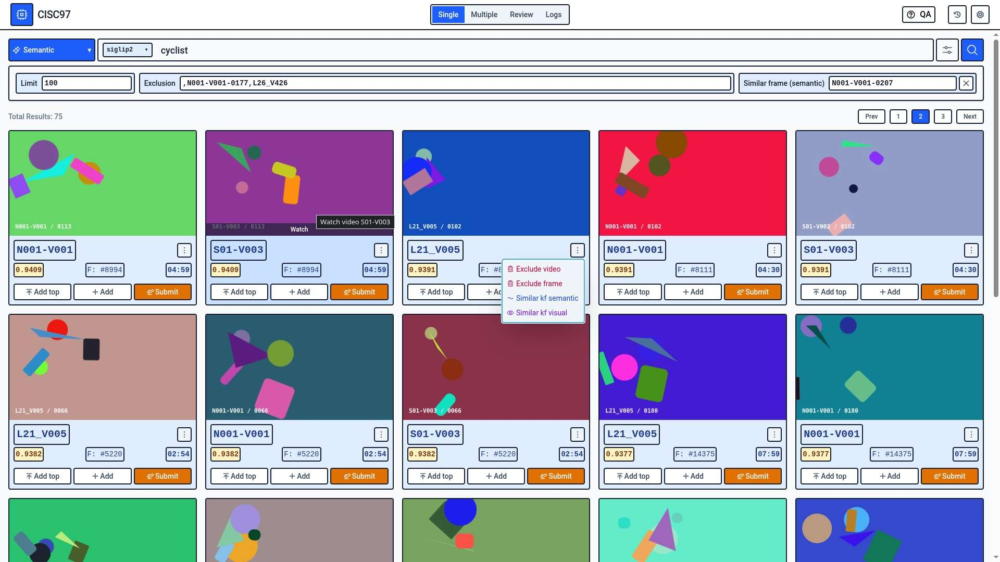
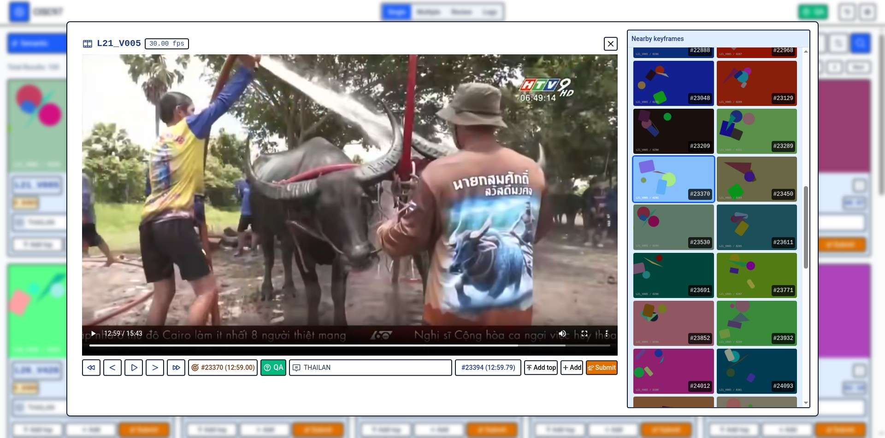
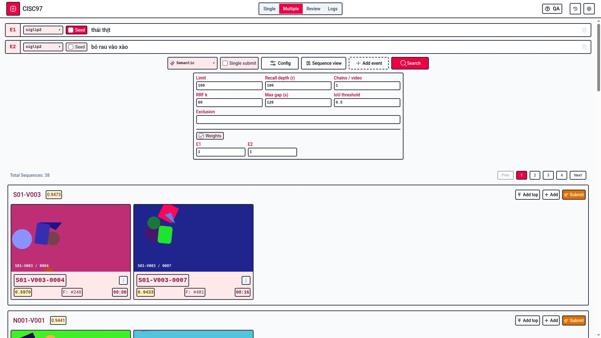
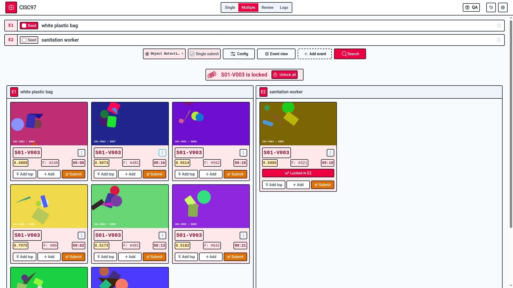
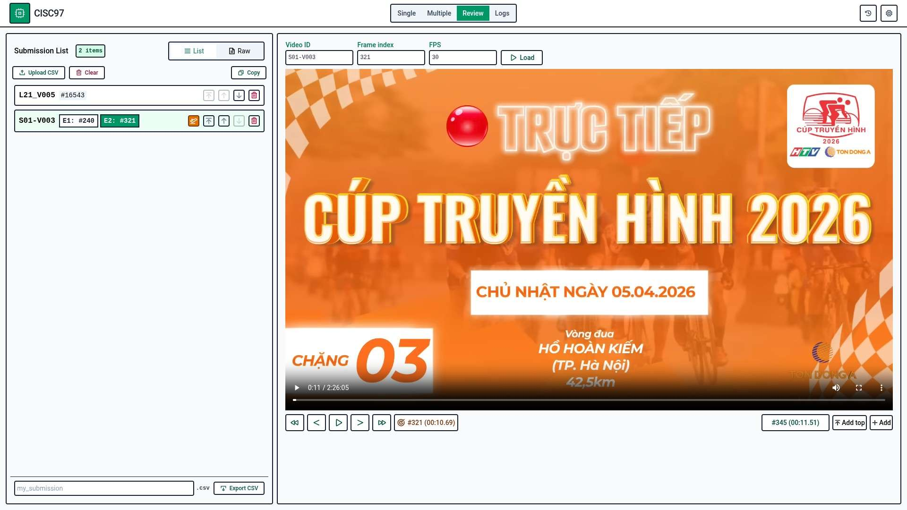
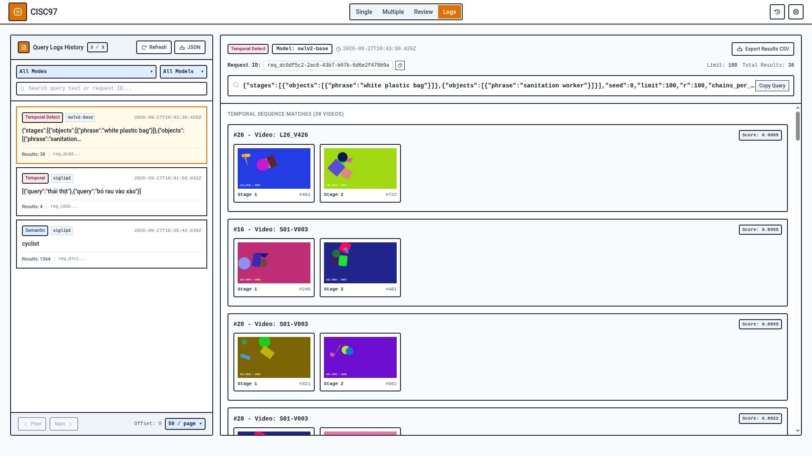
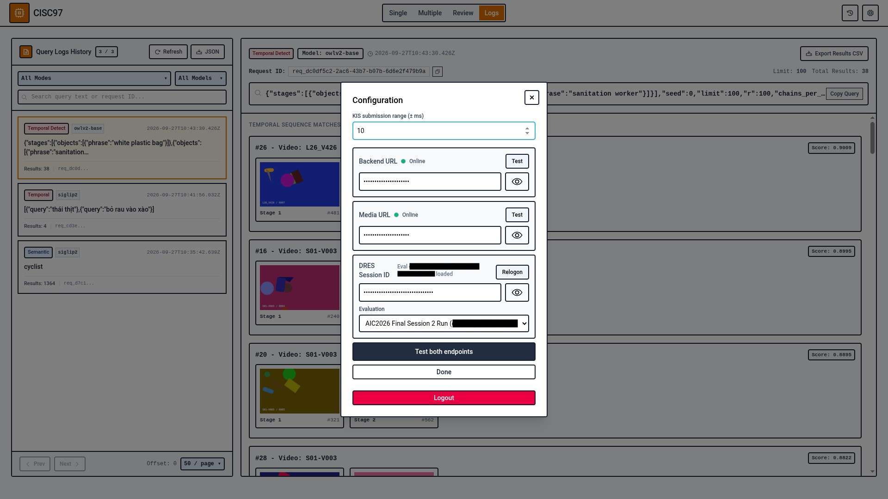

# AIC26 Frontend

Single Page Application (SPA) frontend for the **AIC26** video search engine. 
---

## Tech stack

- **Framework:** [Svelte 5](https://svelte.dev/) (Single Page Application, no SvelteKit)
- **Styling:** [Tailwind CSS](https://tailwindcss.com/)
- **UI Components:** [Bits UI](https://bits-ui.com/) & Phosphor icon & Svelte Sonner (toast notifications)

---

## Project structure

```text
src/
├── App.svelte               
├── lib/                    
│   ├── api.ts                          # Backend API integration
│   ├── appState.svelte.ts              # Global application state
│   ├── auth.svelte.ts                  # Simple client-side check gate
│   ├── config.svelte.ts                # Client configuration settings
│   ├── multipleSearchImpl.svelte.ts    # Multi-query search implementation
│   ├── singleSearchImpl.svelte.ts      # Single-query search implementation
│   ├── reviewQueue.svelte.ts           # Video review queue management
│   ├── submissionHistory.svelte.ts     # Submission history tracker
│   └── types.ts            
└── ui/                    
    ├── AuthModal.svelte
    ├── ConfigModal.svelte              # Configuration dialog
    ├── Header.svelte
    ├── KeyframeCard.svelte             # Video keyframe display card
    ├── Logs.svelte                     # System/action logs viewer
    ├── MultipleSearch.svelte           # multi-query search view
    ├── Review.svelte                   # Review queue view
    ├── SingleSearch.svelte             # Single-query search view
    ├── VideoDialog.svelte 
    ├── VideoFrame.svelte               # Video playback view
    └── common/                         # Reusable UI primitives
```

---

## Usage

### Prerequisites
- **Node.js** (v18+ recommended)
- **npm** (or `pnpm` / `yarn`)

### Installation
Clone the repository and install dependencies:
```bash
npm install
```

Start the local Vite development server with host exposure enabled:
```bash
npm run dev
```

### Configuration

The frontend can be configured directly from the user interface  
- **Backend URL:** The endpoint URL for the AIC video search backend API.
- **Media URL:** The base URL for fetching video streams and keyframe assets.
- **DRES Session ID:** The active DRES (Distributed Retrieval Evaluation Server) session identifier used for evaluation submissions and tracking.

Default value can be changed by consulting file [config.svelte.ts](./src/lib/config.svelte.ts). 
Sample backend server can be obtained [here](https://github.com/risc97/aic26-mock-backend)

The frontend ultilize simple hash check for authorization. The default password is `cizzRIZZ97`. Change can be made in [auth.svelte.ts](./src/lib/auth.svelte.ts)

### Deployment

```bash
docker compose up -d --build
```

## Gallery

### Single search


### Video modal


### Temporal search (Sequential view)


### Temporal search (Event view)


### Review


### Logs


### Configuration modal


## Credit

- @hydroshiba, @DVG3 and @callmelucian for original UI design
- @zeeptobean for reimplementation in Svelte
- @tb-tian for last-minute improvement
- Claude Sonnet 5, GPT-5.6 Luna, Gemini 3.8 Flash and Gemini 3.6 Flash Lite for coding assistance

## License

[MIT License](LICENSE)